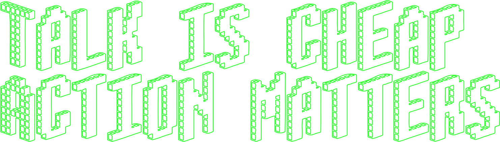

## 👨🏻‍💻 About Me

As a seasoned software developer with almost 20 years of experience (since 2006), I'm now serving the industry as a freelance expert with a passion for problem-solving. I'm an award-winning software developer who takes pride in delivering high-quality and timely performance results and helping my clients WIN.

Well, here's a more in-depth overview of my skills and expertise:

<!-- - [Portfolio](https://CaptMichael.dev)
- [Upwork](https://www.upwork.com/freelancers/~01eed6a13d9b28ab5d)
- [LinkedIn](https://www.linkedin.com/in/XinwenCheng)
- [𝕏 / Twitter](https://twitter.com/CaptMichaelDev)
- [Medium](https://captnotes.medium.com)
- [Archived Blog (in Simplified Chinese)](https://captnotes.github.io) -->

|                                      |                                                     |                                                 |                                                                  |                                                   |                                        |                                                                      |
| ------------------------------------ | --------------------------------------------------- | ----------------------------------------------- | ---------------------------------------------------------------- | ------------------------------------------------- | -------------------------------------- | -------------------------------------------------------------------- |
| [Portfolio](https://CaptMichael.dev) | [LinkedIn](https://www.linkedin.com/in/XinwenCheng) | [Fiverr](https://www.fiverr.com/captmichaeldev) | [Upwork](https://www.upwork.com/freelancers/~01eed6a13d9b28ab5d) | [𝕏 / Twitter](https://twitter.com/CaptMichaelDev) | [Medium](https://captnotes.medium.com) | [Archived Blog (in Simplified Chinese)](https://captnotes.github.io) |

<!-- ## :floppy_disk: GitHub Stats

 -->

## :file_folder: Currently Working On

- [News on Kindle](https://newsonkindle.info): The easiest way to read news on your Kindle.
- [Clear My List](https://clearmylist.io): The next-generation personal time management solution.
- [Dynamic Ideas](https://dynamicideas.ai): The official website presents all of my indie hacking software products and services.

## :hammer_and_wrench: Current Tech Stack

- Primary
  - React & Next.js & React Native
  - Astro
  - Vue.js & Nuxt
  - Express & Node.js
  - NPM Packages
  - MongoDB & Redis
  - Serverless & GraphQL
- Secondary
  - Flutter
  - Python & FastAPI
  - WeChat Mini App

## :sparkles: Fun Facts

- Flying a Cirrus SR-20 has been a dream come true, and I'm on my way to becoming a certified jet pilot.
- I pursued my passion for film by attending the Beijing Film Academy after watching over 1,000 movies. I've watched over 2,160 movies now and continue to hone my expertise.
- While my rate of reading books is slower than movies', the important thing is to keep learning and engaging with ideas. Numbers don't tell the whole story.

## :earth_americas: Want to Reach Me?

- [Email](mailto:CaptMichaelDev@gmail.com?subject=Greeting%20from%20a%20GitHub%20user)

## 🎓 Me on Daily.Dev

<!--  -->

<!-- Emoji icons: https://emojipedia.org -->
<!-- Banner generator: https://fontmeme.com/text-generator -->
