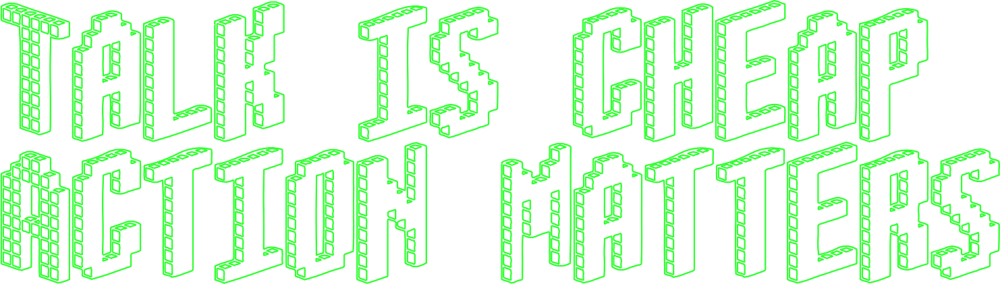

## 👨🏻‍💻 About Me

As a seasoned software developer with 20+ years of experience (since 2006), I am now the Founder of **[Hyperflow](https://hyperflow.sh)**. 

At Hyperflow, we specialize in bringing intelligence to digital workflows and breaking efficiency bottlenecks. We automate the work you hate doing, connect disconnected systems, and accelerate business growth for our clients.

**Find me on:** [𝕏 / Twitter](https://twitter.com/CaptMichaelDev) &nbsp;•&nbsp; [LinkedIn](https://www.linkedin.com/in/XinwenCheng)

## :briefcase: Current Focus: Hyperflow

We provide clear solutions for real efficiency:

- **Automated Workflows & Integrations**: Eliminating double data entry and connecting your favorite apps.
- **Local AI Summarization**: Secure, offline AI tools to instantly summarize endless documents without exposing sensitive data.
- **Premium Business Websites**: Fast, modern, and high-conversion sites that serve as the powerful entrance for your AI-driven workflows.
- **Custom Workflow Upgrades**: Upgrading systems to handle heavy lifting and specific operational bottlenecks.

Learn more at [Hyperflow.sh](https://hyperflow.sh).

## :hammer_and_wrench: Tech Stack Empowering Our Solutions

We build robust, scalable, and intelligent systems using modern technologies:

- **Core & Frontend**: React, Next.js, Astro, Vue.js, React Native
- **Backend & APIs**: Node.js, Express, FastAPI, Serverless, GraphQL
- **Data & AI**: MongoDB, Redis, Local LLMs, Custom AI Workflows
- **Ecosystem**: NPM Packages, WeChat Mini App

## :sparkles: Fun Facts

- Flying a Cirrus SR-20 has been a dream come true, and I'm on my way to becoming a certified jet pilot.
- I pursued my passion for film by attending the Beijing Film Academy after watching over 1,000 movies. I've watched over 2,160 movies now and continue to hone my expertise.
- While my rate of reading books is slower than movies', the important thing is to keep learning and engaging with ideas. Numbers don't tell the whole story.

## :earth_americas: Want to Reach Me?

- [Email](mailto:CaptMichaelDev@gmail.com?subject=Greeting%20from%20a%20GitHub%20user)

## 🎓 Me on Daily.Dev

<!-- Emoji icons: https://emojipedia.org -->
<!-- Banner generator: https://fontmeme.com/text-generator -->
